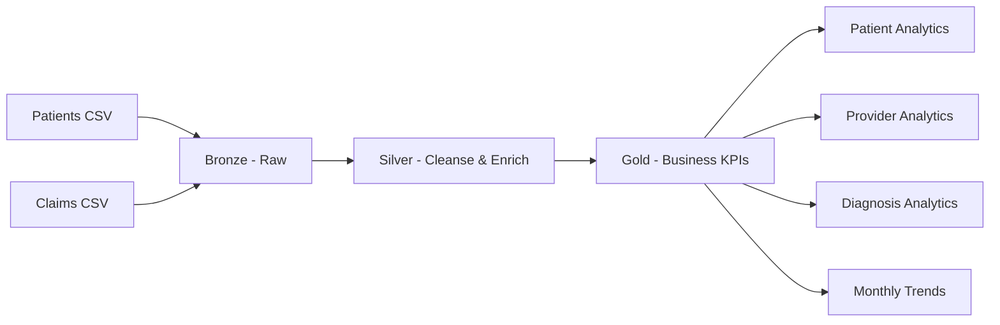

# Healthcare Patient & Claims Analytics — PySpark

A simple-to-intermediate **Data Engineering portfolio project** demonstrating how healthcare patient and claims data can be processed using **PySpark and Medallion Architecture (Bronze → Silver → Gold)**.

> **Important:** All data in this repository is synthetic and created only for learning/demo purposes. It does not contain real patient information.

## Business Problem

Healthcare organizations need to understand claim volumes, healthcare costs, provider performance and patient-level utilization. Raw patient and claims data must be cleaned, validated, enriched and transformed into analytics-ready datasets.

This project answers questions such as:

- What are monthly claim volumes and total claim costs?
- Which patients have the highest healthcare costs?
- Which providers process the highest claim amounts?
- Which diagnoses drive healthcare spending?
- What percentage of claims are successfully paid/approved?
- Which claims are high-cost?

## Architecture



See [docs/architecture.md](docs/architecture.md).

## Medallion Layers

### Bronze
Raw `patients.csv` and `claims.csv` are loaded with minimal transformation.

### Silver
The pipeline performs:

- Duplicate removal using business keys
- Null/key validation
- Date standardization
- Age-band derivation
- Claim-month derivation
- High-cost claim flagging
- Basic numeric validation

### Gold
Business-ready datasets are generated:

| Dataset | Purpose |
|---|---|
| `monthly` | Monthly claim volume, cost and success rate |
| `provider` | Provider claim and cost performance |
| `patient` | Patient utilization and cost ranking |
| `diagnosis` | Diagnosis-level cost analytics |

## PySpark Concepts Demonstrated

- DataFrame API
- CSV ingestion
- Schema inference
- Filtering and cleansing
- Joins
- GroupBy and aggregations
- Conditional expressions
- Date functions
- Window functions
- `dense_rank`
- Derived business metrics
- Unit testing with Pytest

## Data Quality Rules

1. Patient ID must be present.
2. Patient IDs are deduplicated.
3. Patient age must be between 1 and 119.
4. Claim ID must be present.
5. Claim IDs are deduplicated.
6. Claim amount cannot be negative.
7. Claim dates are converted to proper date type.
8. Claims are joined to patient master data using `patient_id`.

## Repository Structure

```text
healthcare-patient-claims-analytics/
├── data/
│   └── raw/
│       ├── patients.csv
│       └── claims.csv
├── docs/
│   ├── architecture.md
│   ├── business_requirements.md
│   ├── data_dictionary.md
│   └── interview_questions.md
├── notebooks/
│   └── 04_end_to_end_pipeline.py
├── src/
│   ├── __init__.py
│   └── pipeline.py
├── tests/
│   ├── conftest.py
│   └── test_pipeline.py
├── .github/workflows/tests.yml
├── requirements.txt
└── README.md
```

## Run Locally

```bash
pip install -r requirements.txt
pytest -q
python src/pipeline.py
```

PySpark requires a compatible Java runtime; the CI workflow uses Java 17.

## Azure Databricks Mapping

| Portfolio Component | Azure Production Equivalent |
|---|---|
| CSV raw data | ADLS Gen2 / OneLake |
| Bronze | Delta Bronze tables |
| Silver | Delta Silver tables |
| Gold | Delta Gold tables |
| PySpark | Azure Databricks |
| Scheduling | Databricks Workflows / ADF |
| Governance | Unity Catalog + Microsoft Purview |
| Reporting | Power BI |

## Productionization Ideas

- Replace CSV with ADLS Gen2 and Delta Lake.
- Add incremental processing using claim ingestion timestamps.
- Partition large claims tables by claim month.
- Add schema enforcement and schema evolution.
- Add centralized data-quality metrics.
- Add PII/PHI protection, masking and role-based access.
- Add Unity Catalog governance and lineage.
- Add monitoring, alerting and SLA tracking.

## Interview Explanation

> “I designed a healthcare analytics pipeline using PySpark and Medallion Architecture. Raw patient and claims data enters Bronze, Silver applies cleansing and enrichment such as deduplication, age bands and high-cost flags, and Gold produces patient, provider, diagnosis and monthly healthcare KPIs. I used joins, aggregations and window functions for business analytics and added automated tests and CI. In Azure, this maps naturally to ADLS Gen2, Databricks, Delta Lake, Unity Catalog, ADF/Workflows, Purview and Power BI.”

## Learning Outcomes

After completing this project, you should be able to explain:

- Why Medallion Architecture is used
- How to design Bronze/Silver/Gold transformations
- How PySpark handles healthcare-style analytical workloads
- How to use joins and window functions
- How to implement data-quality rules
- How to structure a production-oriented PySpark repository
- How the solution maps to Azure Databricks
