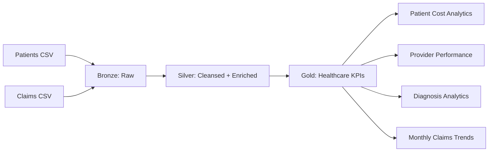

# Architecture

## Azure production mapping

- ADLS Gen2: Bronze/Silver/Gold storage
- Azure Databricks: PySpark transformation and orchestration
- Unity Catalog: governance, permissions and lineage
- Azure Data Factory / Databricks Workflows: scheduling
- Power BI: Gold-layer reporting
- Microsoft Purview: catalog, lineage and governance
